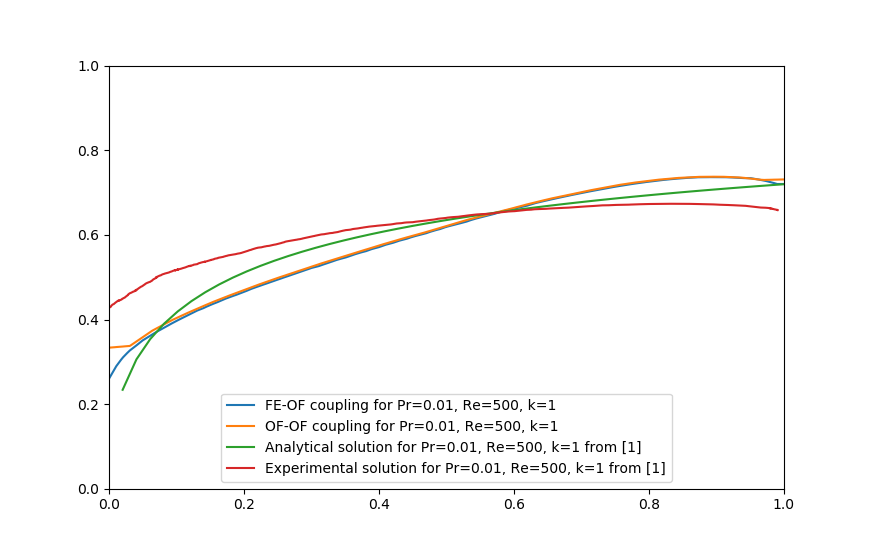

# Experimental Setup

We want to compare the flow over heated plate scenario for two different software setups. We also consider the analytic solution for comparison. We only consider the physical setup with **k=1**, **lambda=0.25**, **Re=500**, **Pr=0.01**, **T_c = 310**, **T_inf=310**. For explanation of the parameters and reference solution, refer to [1]. This specific parameter set has been evaluated in [1] Fig.8 a), [2], [3] and [4].

## 1) OF-OF

We use OpenFOAM for simulation of the fluid and OpenFOAM for simulation of the solid

* source code and running, see [flow-over-plate/buoyantPimpleFoam-laplacianFoam](https://github.com/precice/openfoam-adapter/tree/master/tutorials/CHT/flow-over-plate/buoyantPimpleFoam-laplacianFoam)
* preCICE config being used [`precice-config_serial_FE_OF.xml`](https://github.com/precice/tutorials/blob/GAMMAnnual2019/CHT/flow-over-plate/buoyantPimpleFoam-fenics/validation/precice-config_serial_OF_OF.xml)
* data stored in [`out_OF-OF.csv`](https://github.com/precice/tutorials/blob/GAMMAnnual2019/CHT/flow-over-plate/buoyantPimpleFoam-fenics/validation/out_OF_OF.csv)

## 2) FE-OF

Using OpenFOAM for simulation of the fluid and FEniCS for simulation of the solid.

* source code and running, see [flow-over-plate/buoyantPimpleFoam-fenics](https://github.com/precice/tutorials/tree/GAMMAnnual2019/CHT/flow-over-plate/buoyantPimpleFoam-fenics)
* preCICE config being used [`precice-config_serial_FE_OF.xml`](https://github.com/precice/tutorials/blob/GAMMAnnual2019/CHT/flow-over-plate/buoyantPimpleFoam-fenics/validation/precice-config_serial_FE_OF.xml)
* data stored in [`out_FE-OF.csv`](https://github.com/precice/tutorials/blob/GAMMAnnual2019/CHT/flow-over-plate/buoyantPimpleFoam-fenics/validation/out_FE_OF.csv)

## 3) analytic solution

For derivation see [1].

## 4) experimental solution

From numerical experiments in [1].

## Comments

The data `*.out` is obtained from the vtk output of the solid part of the simulation. We use paraview to exporting the data of *plot over line* along the coupling boundary.

The simulation has to be run for a larger amount of time (approx. 50s simulation time, see `precice-config`) in order to reach steady state. **For the sake of speeding up the computation, the timestep size has been increased for the FEniCS solver!**

## Postprocessing

Run `python3 plotParaviewOut.py` to obtain the plot with the results.
 
## Results

* Simulation results match each other
* Both simulation results miss analytical solution and experimental solution
* in [1, p.55] it is already mentioned that Pr = 0.01 might be too low for the analytical solution.
* The difference between our experiemnts and the ones in [1] might be due to the slightly different scenarios. In our case, we have a channel with fluid; in [1] we have a half plane.

## References

[1] Vynnycky, M., Kimura, S., Kanev, K., & Pop, I. (1998). Forced convection heat transfer from a flat plate: the conjugate problem. International Journal of Heat and Mass Transfer, 41(1), 45–59.  
[2] Cheung Yau, L. (2016). Conjugate Heat Transfer with the Multiphysics Coupling Library preCICE. Technical University of Munich.  
[3] Reiser, A. (2018). Extending a CFD Lab Course by a preCICE Conjugate Heat Transfer Tutorial. Technical University of Munich.  
[4] Chourdakis, G. (2017). A general OpenFOAM adapter for the coupling library preCICE. Technical University of Munich.  
